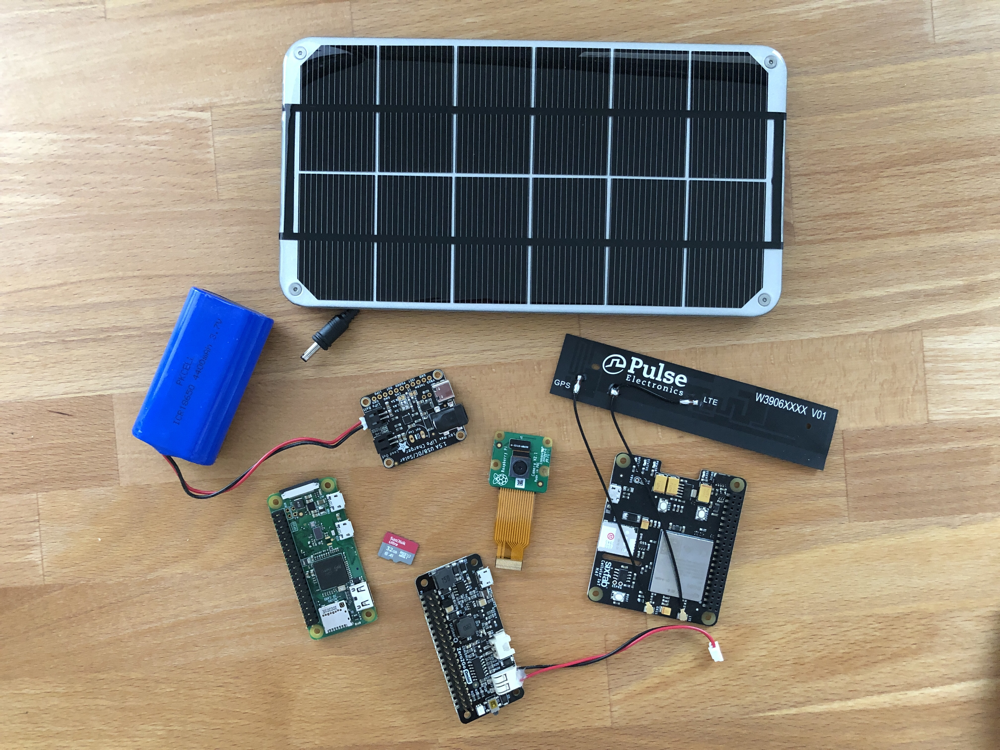

# DIY "Smart" IoT Trail Camera

I wanted a way to remotely observe wildlife and create some timelapses of a peice of property that I own.  The land is undeveloped and located in a very rural area without power service so this has to be a mostly offgrid solution, but there is cellular covereage.

The sensible decision would probably be to buy one of those fancy [Solar Cellular Trail Cameras](https://www.amazon.com/SPYPOINT-LINK-S-Solar-Camera-Verizon/dp/B06XP4FCDP/ref=sr_1_6?crid=3AI1LA3XXD84O&dchild=1&qid=1601837926&sprefix=solar+cellu%2Caps%2C200&sr=8-6), but I'm far from sensible.

Must Haves
- Take pictures 
- Pictures visible remotely on mobile or desktop
- Run without a wired power source
- Weatherproof
- Remote updates and retasking

Nice to Have
- Schedule-driven and On-demand picture taking
- Motion-activated picture taking
- Perform image analysis (detect snow/rain, identify wildlife)
- Environmental readings (temperature, humidity, solar power, battery stats)

## Tasks
1. [Access the internet on the device via the cellular modem](./Task1/Task1.md)
2. Get Pi working with AWS Greengrass IoT
3. Use Greengrass to task a picture and post to S3 with always-on connection
4. Do #3 with periodic connection (saving battery by only connected periodically)
5. Sustain with only solar and battery power.
6. Waterproof container and installation
7. Get pictures and other data from remote location
8. Profit!

## Hardware
- Variety of Raspberry Pi's from which to choose
    - Pi Zero W
    - Pi 4
    - Pi 3B+
    - Pi 2B
- Voltaic 3.4W 6V Solar Panel
- Sixfab Cellular IoT Hat
- Twilio SuperSIM sim card and service
- Pi Camera v2.1
- Zero2Go Omini Power Controller
- Adafruit USB/DC/Solar LiPo Charger
- 4400mAh LiPo battery
- 2500mAh LiPo battery
- Sandisk Ultra 32GB microSD card
- DHT22 Temperature and Humidity Sensor

