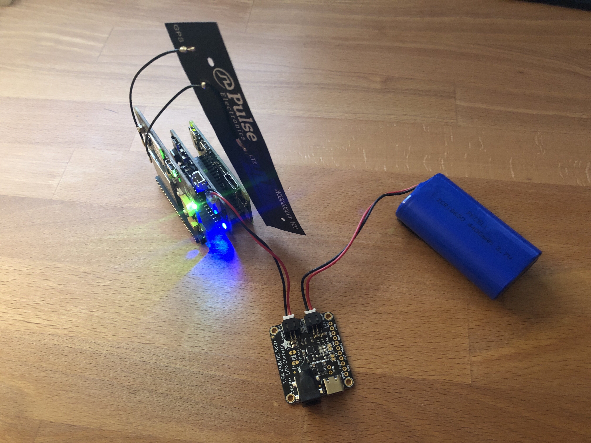

# Task 1 - Get All The Hardware Connected



1. Download Raspberry OS Lite and burn to the microSD card.
2. Assemble the hats.
3. Update locale, timezone
4. Update Raspberry OS.
5. Enable I2C and Serial UART (but not serial login shell)
6. ```sudo apt install python3 python3-serial python3-rpi.gpio python3-smbus```
7. ```sudo pip3 install sixfab-cellulariot```
8. Install  omini software to monitor incoming voltage. (Edited to not install the web console as it apparently doesn't work with Pi Zero) [```installZero2Go.sh```](./src/installZero2Go.sh)
9. Activate SIM
10. ~~Activate and test modem~~   *FAIL: The AT Commands just hang*
11. ~~Install QMI driver for CellularIoT hat from SixFab~~ *FAIL: See 12* 
12. ~~Test QMI driver as interface~~ *FAIL: could not get IP address from DHCP*
13. Installed PPP method of connecting using ~~```/dev/ttyAMA0```~~ ```/dev/serial0```.  *SUCCESS*
14. Turn PPP connection on and off using ```pon``` and ```poff```.
15. Create script to power up modem, make connection, drop connection and power down modem. [```upload_something.sh```](./src/upload_something.sh), [```modem_down.py```](./src/modem_down.py), [```modem_up.py```](./src/modem_up.py)

## Notes
- Public Service Announcement:  when flashing a image to removeable media with the ```dd``` command, do be sure to check your paths.  My brain said ```/dev/sdc``` but my fingers typed ```/dev/sda```.  OS needed to be reloaded anyway...at least that's what I told myself.
- Initially, when messing with the modem, I was able to get AT commands to work via command-line Python, but after I reloaded the OS for a fresh start, I wasn't able to get the commands to work anymore.  Not sure what changed, but I was still able to use the ```sixfab-cellulariot``` Python library to issue commands.
- The QMI detour was disappointing as that seems to be Sixfab's recommended method over PPP.  It involved downloading kernel headers, flashing the specific firmware version for the header versions and compiling the driver.  I was never able to get the modem to get an IP address from DHCP.  I even tried including ```denyinterfaces wwan0``` in ```/etc/dhcpcd.conf``` because the QMI driver apparently likes to use ```udhcp``` rather than the default ```dhcpcd```.  Still no dice.
- Finally got an IP address using PPP.  Remember that the PPP daemon updates the routes so when you drop the connection, your default route to the internet might not be there anymore.  You'll have to issue something like this to store that default route when not on PPP:  ```sudo route add default gw <your gateway ip> wlan0```

Ok, with this working, I can envision a method where, driven by a cron job, I can initiate an internet connection periodically instead of having the modem sucking power all the time just being mostly idle.  Supposedly, the Quectel BG96 module in the Sixfab modem has a power-saving mode, but unsure if it could truly reach that because the PPP daemon or other OS processes might be doing keep-alives.

Time to get an image of the SD card so I don't have to start from scratch again if I mess things up later.  We're surfin the net!!!


