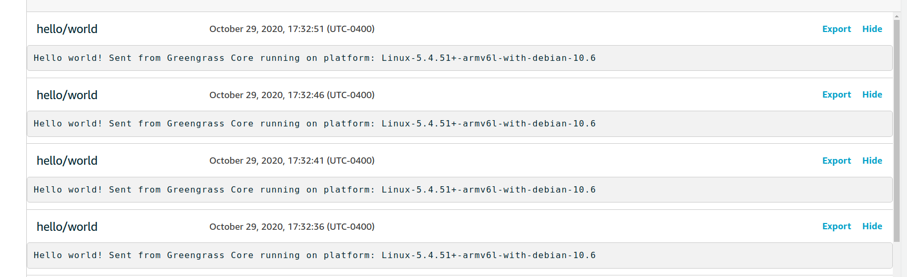

# Task 2 - AWS IoT Greengrass on Pi Zero

AWS IoT Greengrass, in short, is a way to extend some AWS services all the way to your IoT devices.  *But you say....Scott, why hassle with Greengrass?  There are much easier ways to get a photo from a Pi to somewhere on the internet...* Yes, you're absoltely correct.  First, I wanted to dig more into Greengrass and learn its limitations and capabilities.  Second, I might want to expand my fleet of devices from one lonely Pi Zero to many..all waiting eagerly to do my bidding.  I can envision anything from a weather station to a solar array tracker to a mesh network.  I could probably even hack my [DeepRacer](https://github.com/scottpletcher/deepracer) to search and destroy weeds in my yard or be a robot sentinel for my garden when the rabbits make their raid at 2am. 

Anyone can manage one single device, but it takes some doing to manage devices at scale and this is where AWS Greengrass and indeed AWS in general shines.

Fortunately, AWS has documentation on [how to setup a Raspberry Pi for Greengrass](https://docs.aws.amazon.com/greengrass/latest/developerguide/setup-filter.rpi.html).  We can start with Step 9 as we already have the Pi setup.

1. Add Greengrass user and group, enable hardlink and symlink protection and enable memory cgroups. Reboot.
2. Install the Java 8 runtime so we can use Stream Manager.
3. Download and run the Greengrass Dependency checker  *Java8 not in path, update path. NodeJS not found.  I prefer Node or Python for my Lambda functions so I'll need to install Node too.  Python is already there.*
4. Since the Pi Zero uses an ARMv6, needed to chase down the ["unofficial" binaries](https://unofficial-builds.nodejs.org/download/release/v12.19.0/) at nodejs.org.
5. Dependency Checker is happy, on to installing Greengrass Core.  Log into the AWS Console and create the Greengrass group and download the security stuff.
6. Downloaded and installed the Greengrass Core.  Added it to systemd as described [here](https://docs.aws.amazon.com/greengrass/latest/developerguide/gg-core.html#start-on-boot) and [here](https://www.raspberrypi.org/documentation/linux/usage/systemd.md)
7. Get a basic HelloWorld Lambda function deployed on our Pi as described [here](https://docs.aws.amazon.com/greengrass/latest/developerguide/module3-I.html) *FAIL: First attempt to deploy Lambda to Pi failed...*
8. After looking through the Greengrass logs on the Pi, seems that Streaming Manager is failing to start with some Java exception.  I don't think I need it so disabling it for the group via the console.  After doing that and resetting the deployments, all seems well. *SUCCESS*
9. Using the MMQT client on the AWS IoT console, I'm able to see the messages my little Pi is sending...
```Hello world! Sent from Greengrass Core running on platform: Linux-5.4.51+-armv6l-with-debian-10.6```


## Notes
- Per the Dependency Checker for Greengrass, I had to rename both the ```node``` and ```java``` binaries to ```nodejs12.x``` and ```java8``` to make it happy.  I used a symlink so I hope that won't bite me in the future.
- Streaming Manager hung me up for a little while so I ended up disabling it for now.  
- One thing to note for MQTT subscriptions...to get bi-directional communication using MQTT, I'll need to have a Pub/Sub from the Pi (Lambda) to the IoT Cloud and also from the IoT Cloud to the Pi.
- Maybe I can use this HelloWorld example to expand to an on-demand Lambda function that can take a picture.  I could publish a message to a topic which the Pi is subscribed to trigger a Lambda function that takes a picture and uploads to S3 perhaps?  I know how to take a picture using the Pi Camera module in Python, but is the Lambda function jailed such that it can't communicate with the local hardware?
- I keep seeing reference to a *shadow* in Greengrass...wonder if this is similar to a [digital twin](https://en.wikipedia.org/wiki/Digital_twin)?

Well, I think we can call this task complete.  Greengrass is running on the Pi Zero and we've been able to deploy a Lambda function to it and get some messages back!

